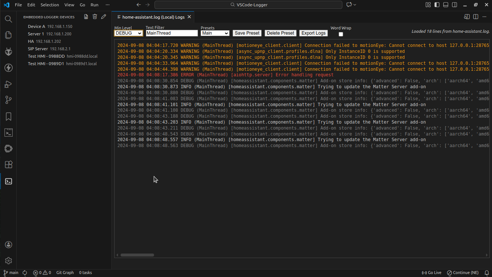

# Embedded Device Logger

A Visual Studio Code extension that connects to embedded Linux devices over SSH, tails their logs, and displays them with loglevel colorization, filtering presets, custom keywords highlighting and filtered export.



## Features

- Activity Bar view listing configured devices.
- **Real-time log streaming over SSH** using a configurable command (default: `tail -F /var/log/syslog`).
- **Log level parsing, filtering, and colorization** inside a Webview panel per device.
- Saved filter presets stored per device.
- **Highlight up to 10 custom keywords** with color-coded, bold, underlined text in both live and imported logs.
- **Find text inside live or imported logs** with Ctrl/Cmd+F, including next/previous navigation.
- **Reconnect closed SSH sessions** directly from the log panel and automatically mark the log when a device closes a session.
- **Export** currently visible (filtered) logs to a file.
- **Auto-save** to file option for live SSH logs.
- **Open any log files and filter them** with the same interface.
- SSH passwords are **stored securely** with VS Code Secret Storage.
- **Privacy focused**. **No telemetry**. Everything **runs locally**.
- **Built with security in mind**.

## Configuration


Add devices in your VS Code settings under `embeddedLogger.devices`:

```json
"embeddedLogger.maxLinesPerTab": 100000,
"embeddedLogger.devices": [
  {
    "id": "deviceA",
    "name": "Device A",
    "host": "192.168.1.10",
    "port": 22,
    "username": "root",
    "logCommand": "tail -F /var/log/syslog"
  }
]
```

If no password is stored yet, the extension prompts for it when connecting and saves it locally and securely.

- Control memory usage by capping retained lines per log tab with `embeddedLogger.maxLinesPerTab` (default: 100000). For auto-save, this limit is not applied to a file. Everything is saved.

## Notes

- Colorization of lines are done based on the loglevel (DEBUG, INFO, ERROR, etc). If these keys are not present in the log, no colorization will be applied.
- Presets are stored per-device in the workspace state using the key `embeddedLogger.presets.<deviceId>`.
- Exports only include log lines currently visible after applying filters.
- When an SSH session closes, the log view appends `--- SSH session closed on <timestamp>` and offers a **Reconnect** button next to the status text to restart streaming.
- Click the search icon in the Embedded Logger devices view to add up to ten highlight rows, each with its own colour and editable keyword that updates live and imported logs instantly.
- Use the **Open Local Log File** title button in the Embedded Logger devices view (or run the command with the same name) to select a `.log` or `.txt` file from your machine. The chosen file is loaded into the log viewer so you can reuse filtering, presets, export filtered logs and highlights just like a live connection.
- **Status** also shows messages from the log command used in the configuration like `tail -F /var/log/syslog`. So, some messages like: `tail: '/var/log/syslog' has appeared; following new file` may appear. This message in particular happens when the log file is rotated or recreated. The `-F` flag tells `tail` to keep watching for the file to reappear, so the message is informational and indicates that log streaming will continue with the new file. If you prefer a different log source, update the `logCommand` in your device configuration.

## Share Activity Bar with other extensions

The **Embedded Device Logger** extension supports sharing the VSCode Activity Bar with other extensions. To merge an extension into the Activity Bar, simply select its icon from the Side Bar, then drag and drop it into your desired position within the Activity Bar.


In the example, the other extensions (from other publishers) are:
- `elcamilet.ssh-connect`
- `ikoamu.side-clipboard`

## Installation

* **From VSCode:** Click on Extensions in the side bar and Search for Embedded Device Logger (Publisher: Scallant, Author: A. Scillato).
* **From VSCode Marketplace:** See https://marketplace.visualstudio.com/items?itemName=Scallant.embedded-device-logger

----

## For Developers

### Source Code

- See [Source Code](https://github.com/ascillato/VSCode-Logger)
- **License:** MIT

### Source Code Documentation

- See [Documentation](https://ascillato.github.io/VSCode-Logger/index.html)

### Running The Extension Locally

1. Clone the repository
2. Run `npm install` to install dependencies.
3. Run `npm run compile` to build the TypeScript.
4. Press `F5` in VS Code to launch the extension development host and open the **Embedded Logger** view.

### Package Generation

- Requires: `npm install -g @vscode/vsce`
- Run: `vsce package` to generate vsix file to be installed into VSCode
- Install locally on VSCode: `code --install-extension embedded-device-logger-0.6.0.vsix`

### Clean and re-compile

- `clear; rm -rf node_modules; rm -rf out; rm *.vsix; npm install; npm run compile; vsce package`
- `code --install-extension embedded-device-logger-0.6.0.vsix`

### Generating Source Code Documentation

1. Ensure Doxygen is available locally (`sudo apt-get install doxygen`).
2. From the repository root, run `doxygen Doxyfile` to build the documentation into `docs/html`.
3. Open `docs/html/index.html` in a browser to review the generated API reference.
