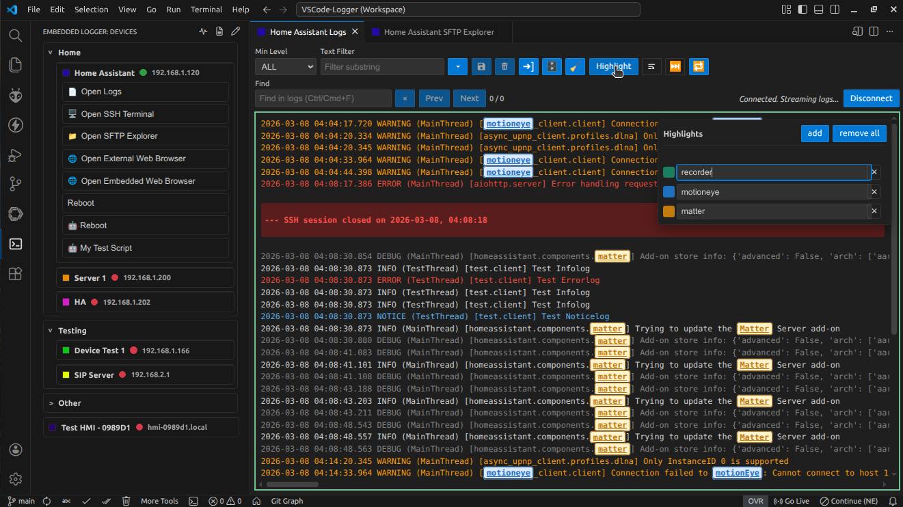
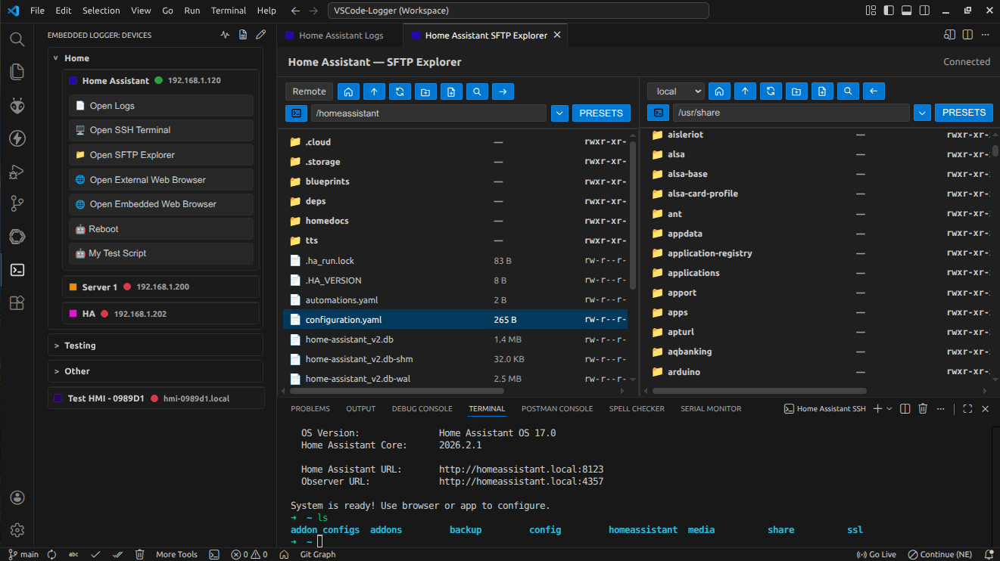
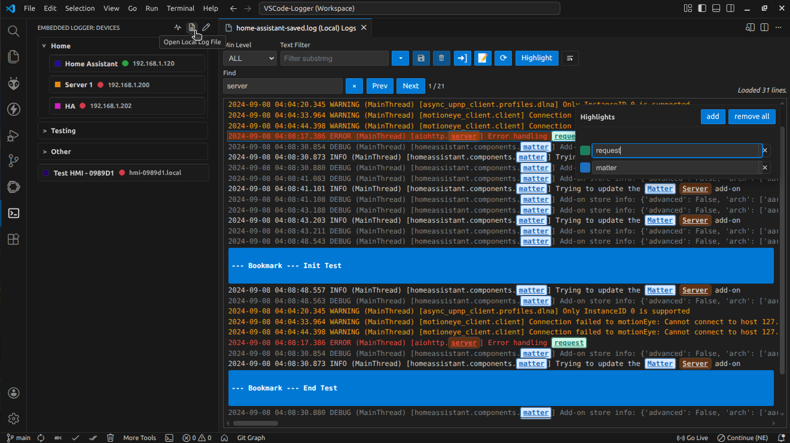
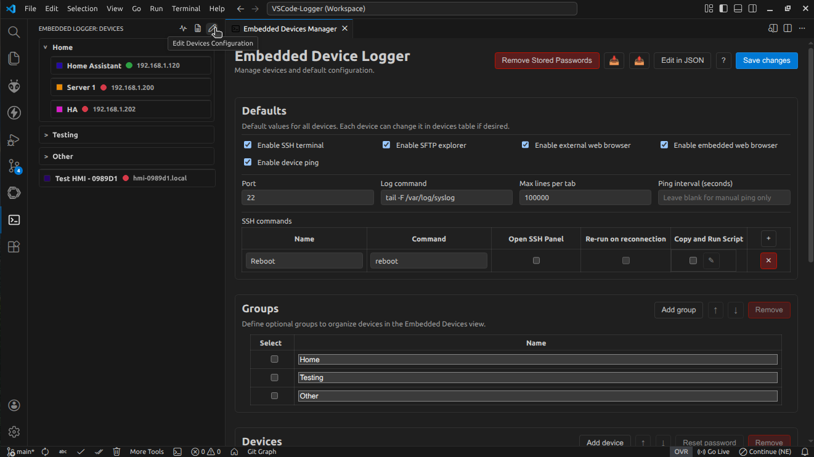

# Detailed Usage and Configuration

The Embedded Device Logger is a Visual Studio Code extension that can connect to your devices over SSH, tail their logs, and help you analyze the data with loglevel colorization, quick filters, custom keywords highlights and filtered export. It provides also an SFTP client, SSH terminals and one-off SSH commands to help you develop, debug and maintain your Linux-based devices.

- **Live logs view:**



- **SFTP Panel view and SSH terminal:**



- **Offline logs view:**



If you like the extension, please [rate it](https://marketplace.visualstudio.com/items?itemName=Scallant.embedded-device-logger&ssr=false#review-details). We welcome issue reports and feature requests.

## Full feature set

- Activity Bar view listing configured devices.
- **Real-time log streaming over SSH** using a configurable command (default: `tail -F /var/log/syslog`).
- **Log level parsing, filtering, and colorization** inside a Webview panel per device.
- Saved filter presets stored per device.
- **Highlight up to 10 custom keywords** with color-coded, bold, underlined text in both live and imported logs, configured per log panel.
- **Find text inside live or imported logs** with Ctrl/Cmd+F, including next/previous navigation.
- **Reconnect closed SSH sessions** directly from the log panel and automatically mark the log when a device closes a session.
- **Export** currently visible (filtered) logs to a file.
- **Auto-save** to file option for live SSH logs.
- **Open any log files and filter them** with the same interface.
- Add, edit, and remove **Bookmarks** in live logs and imported logs.
- Run optional **on-demand SSH commands** configured per device from the Devices view.
- Optionally **launch an SSH terminal** directly from a device card when enabled in settings.
- Optionally open a dual-pane **SFTP explorer** to browse remote and local files side-by-side and transfer files.
- Optionally open the configured device URL in your default **web browser** from the device card when enabled.
- Authenticate with SSH passwords or private keys.
- SSH passwords and private key passphrases are **stored securely** with VS Code Secret Storage.
- **Privacy focused**. **No telemetry**. Everything **runs locally**.
- **Built with security in mind**.

## Getting started

- Install the extension as explained under [Installation](#installation).
- Open it by clicking on the terminal icon of the side bar.
- Configure your devices by clicking on the pencil icon. Add them under the `embeddedLogger.devices` setting as explained in [Configuration](#configuration), then open the **Embedded Logger** view from the activity bar.

## Installation

**From VS Code:**
- Click on Extensions in the side bar and search for **Embedded Device Logger** (Publisher: Scallant, Author: A. Scillato).
- Or from the VS Code Quick Open (Ctrl+P), paste the command: `ext install Scallant.embedded-device-logger`, and press Enter.
- Or from the console: `code --install-extension Scallant.embedded-device-logger`.

For more information visit the [Embedded Device Logger extension](https://marketplace.visualstudio.com/items?itemName=Scallant.embedded-device-logger) in the VS Code Marketplace.

## Configuration



You can configure everything from the **Device Manager** panel (click the pencil icon or run **Embedded Logger: Edit Devices Configuration**):

- Add/remove devices in a table UI. Each row exposes every supported key:
  - `id`, `color` (optional tab/device label color), `name`, `host`, and optional `port` for addressing.
  - `hostFingerprint`, `secondaryHost`, and `secondaryHostFingerprint` for host-key pinning and automatic fallback.
  - `bastion.host`, `bastion.port`, `bastion.username`, `bastion.hostFingerprint`, `bastion.password`, `bastion.privateKeyPath`, and `bastion.privateKeyPassphrase` for jump-host tunnelling.
  - `username`, `password`, `privateKeyPath`, and `privateKeyPassphrase` for authentication (password and passphrase values are migrated into Secret Storage on first use).
  - `logCommand` plus feature toggles: `enableSshTerminal`, `enableSftpExplorer`, `enableWebBrowser`, and `webBrowserUrl`.
  - `sshCommands` with per-command `name` and `command` values.
- Adjust defaults without hand-editing JSON: `embeddedLogger.defaultPort`, `embeddedLogger.defaultLogCommand`, `embeddedLogger.defaultEnableSshTerminal`, `embeddedLogger.defaultEnableSftpExplorer`, `embeddedLogger.defaultEnableWebBrowser`, `embeddedLogger.defaultSshCommands`, and `embeddedLogger.maxLinesPerTab`.
- Prefer raw JSON? Use **Edit in settings.json** from the Device Manager or paste the example below into `.vscode/settings.json`.

Add devices in your VS Code settings under `embeddedLogger.devices` if you prefer to edit JSON directly:

```json
"embeddedLogger.maxLinesPerTab": 100000,
"embeddedLogger.devices": [
  {
    "id": "deviceA",
    "color": "#4fc3f7",
    "name": "Device A",
    "host": "192.168.1.10",
    "hostFingerprint": "SHA256:your-device-fingerprint",
    "secondaryHost": "192.168.1.11",
    "secondaryHostFingerprint": "SHA256:backup-device-fingerprint",
    "bastion": {
      "host": "bastion.example.com",
      "hostFingerprint": "SHA256:bastion-fingerprint",
      "port": 22,
      "username": "jump-user"
    },
    "port": 22,
    "privateKeyPath": "${env:HOME}/.ssh/id_ed25519",
    "username": "root",
    "logCommand": "tail -F /var/log/syslog",
    "enableSshTerminal": true,
    "enableSftpExplorer": true,
    "enableWebBrowser": false,
    "webBrowserUrl": "http://192.168.1.10",
    "sshCommands": [
      {
        "name": "Restart IOT",
        "command": "systemctl restart fw-iot"
      }
    ]
  }
]
```

Names for commands support emojis that can be copied from: https://emojidb.org.

If no password is stored yet, the extension prompts for it when connecting and saves it locally and securely. When using an encrypted private key, the passphrase is requested once and stored securely in VS Code Secret Storage. Private key paths may include `~` or `${env:VAR}` tokens for convenience.

**Pin each device's host key** by setting `hostFingerprint` to the device's SSH host key fingerprint (for example, `ssh-keygen -lf /etc/ssh/ssh_host_ed25519_key.pub -E sha256`). If no fingerprint is configured, the extension records the server's fingerprint on the first successful connection. When a server presents a different fingerprint later, you'll be prompted to accept the new value before reconnecting.

**Optionally configure a secondary host** via `secondaryHost` (and `secondaryHostFingerprint` when pinning). Connections start with the primary host and automatically fall back to the secondary host when the primary connection fails; if the secondary host also fails, the extension retries the primary host.

**[EXPERIMENTAL] Tunnel through a bastion/jump host** by supplying a `bastion` block with its `host`, `username`, optional `port`, and optional `hostFingerprint` plus password or private key authentication. Secrets and host key fingerprints for the bastion are stored independently in Secret Storage and captured on first connect when omitted.

Set `enableSshTerminal` to control visibility of the **Open SSH Terminal** button alongside any configured SSH commands for that device (the action is enabled by default; set it to `false` to hide it). The **Open SSH Terminal** action opens a dedicated VS Code terminal tab for the device and authenticates using the stored password or private key (prompting for and saving the credential securely when missing).

Set `enableSftpExplorer` to control visibility of the **Open SFTP Explorer** button on the device card (enabled by default; set it to `false` to hide it). The explorer opens a dual-pane view with the remote home on the left and the local home on the right, including navigation, rename/delete/duplicate actions, and arrows to transfer selected files between panes (or between two remote panes when the right-side mode is switched to remote). It also supports quick search (type to jump; press Enter to cycle matches) and keyboard shortcuts (Arrow Up/Down to move selection, Enter to open a folder or view file content when quick search is hidden, Delete to remove, Backspace to go up a directory, F2 to rename, Ctrl/Cmd+D to duplicate, Ctrl/Cmd+P to change permissions). Entering folders or going up automatically selects the first entry so you can keep navigating with the keyboard. If the SSH link drops, the explorer stays open, greys out, shows a reconnection countdown beside the title, and automatically retries every five seconds without losing the active remote paths.

Set `enableWebBrowser` to surface the **Open WEB Browser** button beneath each device. The button is disabled by default; when enabled, clicking it opens the configured `webBrowserUrl` if provided, otherwise the extension opens `http://<host>` derived from the device host (including any port in the custom URL when supplied). Both `http://` and `https://` URLs are supported.

Control memory usage by capping retained lines per log tab with `embeddedLogger.maxLinesPerTab` (default: 100000). For auto-save, this limit is not applied to a file. Everything is saved.

All options are available through the VS Code Settings UI under **Embedded Device Logger**, including defaults for omitted device values:

- `embeddedLogger.defaultPort` – applied when a device does not specify a port.
- `embeddedLogger.defaultLogCommand` – used when `logCommand` is omitted.
- `embeddedLogger.defaultEnableSshTerminal` – toggles whether the SSH terminal action is shown by default (default: true).
- `embeddedLogger.defaultEnableSftpExplorer` – toggles whether the SFTP explorer action is shown by default (default: true).
- `embeddedLogger.defaultEnableWebBrowser` – toggles whether the web browser action is shown by default (default: false).
- `enableWebBrowser` – when set to true per device, the **Open WEB Browser** button opens `webBrowserUrl` if configured or `http://<host>` otherwise.
- `embeddedLogger.defaultSshCommands` – shared SSH actions applied to devices that do not define their own list.

## Notes

- **Colorization of lines** is performed based on the log level (DEBUG, INFO, ERROR, etc). If these keys are not present in the log, no colorization is applied.
- **Filtering presets** are stored per-device in the workspace state using the key `embeddedLogger.presets.<deviceId>`.
  - Open the filter preset dropdown (caret button next to **Text Filter**) to pick an existing preset or clear the current selection. The dropdown supports keyboard navigation (ArrowDown to open; Escape to close).
  - Saving a preset now uses the current text filter value as the preset name and stores the active min-level and filter text together. The **Save preset** button enables when the text filter is non-empty and differs from the active preset.
  - Changing the text filter clears the active preset selection so you do not overwrite an existing preset unintentionally.
  - Deleting a preset clears the text filter and list selection.
- Exports only include log lines currently visible after applying filters.
- When an SSH session closes, the log view appends `--- SSH session closed on <timestamp>` and offers a **Reconnect** button next to the status text to restart streaming.
- Use the **Highlight** button in each log panel to manage up to ten highlight rows, each with its own colour and editable keyword that updates that panel instantly.
- Use the **Open Local Log File** button in the Embedded Logger devices view (or run the command with the same name) to select a `.log` or `.txt` file from your machine. The chosen file is loaded into the log viewer so you can reuse filtering, presets, export filtered logs, and highlights just like a live connection.
- **Status** text also shows messages from the log command used in the configuration like `tail -F /var/log/syslog`. Messages such as `tail: '/var/log/syslog' has appeared; following new file` may appear when the log file is rotated or recreated. The `-F` flag tells `tail` to keep watching for the file to reappear, so the message is informational and indicates that log streaming will continue with the new file. If you prefer a different log source, update the `logCommand` in your device configuration.
- The Embedded Device Logger extension supports **sharing the VS Code Activity Bar** with other extensions. To merge an extension into the Activity Bar, select its icon from the Side Bar, then drag and drop it into your desired position within the Activity Bar.
- This extension also supports connecting to devices through a VPN (already running on the machine with VS Code).
