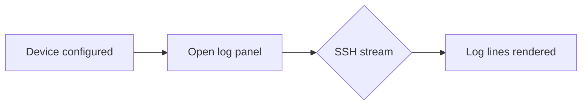

# VSCode-Logger Documentation Generation

Welcome to the VSCode-Logger documentation site. This extension streams logs from embedded Linux devices over SSH into Visual Studio Code, providing filtering, highlighting, presets, and exporting. These pages collect architecture notes, user guidance, and generated API references.

## Diagrams

Mermaid diagrams in Markdown work with fenced code blocks. For example:

## API reference

The API reference is generated from Doxygen XML via Breathe. Run `doxygen Doxyfile` before building Sphinx so the `api/` section can render the latest symbols.

## Building this documentation

1. Install doc tooling with `pip install -r docs/requirements.txt`.
2. Generate XML output for Breathe using `doxygen Doxyfile` (outputs to `docs/xml`).
3. Build the site with `sphinx-build -b html docs/source docs/build/html`.
4. GitHub Actions publishes the built HTML to the `gh-pages` branch on each push to `main` with tag.
