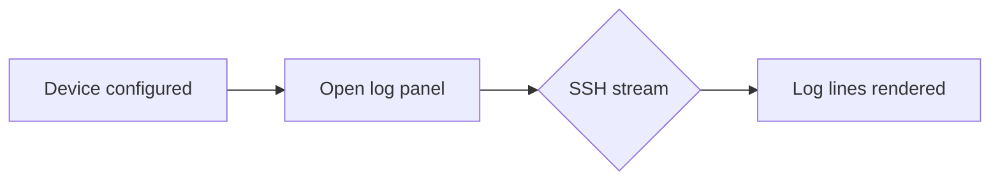

# VSCode-Logger Documentation Generation

Welcome to the VSCode-Logger documentation site. This extension streams logs from embedded Linux devices over SSH into Visual Studio Code, providing filtering, highlighting, presets, and exporting. These pages collect architecture notes, user guidance, and generated API references.

## Diagrams

Mermaid diagrams in Markdown work with fenced code blocks. For example:

## API reference

The API reference is generated with TypeDoc and surfaced inside Sphinx. When Sphinx builds the site, it runs TypeDoc (when available) to refresh the `docs/typedoc` output so the `api/` section stays up to date.

## Building this documentation

1. Install doc tooling with `pip install -r docs/requirements.txt`.
2. (Optional) Generate the TypeDoc HTML output with `npm run docs:typedoc` (outputs to `docs/typedoc`).
3. Build the site with `sphinx-build -b html docs/source docs/build/html` (Sphinx runs TypeDoc when available).
4. GitHub Actions publishes the built HTML to the `gh-pages` branch on each push to `main` with tag.
