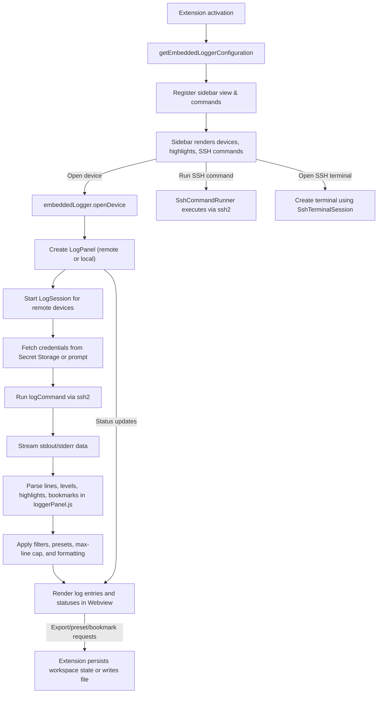

# VSCode-Logger Architecture Overview

This document explains how the VSCode-Logger extension streams logs from embedded Linux devices into Visual Studio Code. It covers the activation lifecycle, major components, data flows between the extension host and the Webview, and key configuration or security considerations.

## Activation and configuration
- **Activation trigger**: The extension activates when VS Code loads the workspace or when a contributed command or view is invoked.
- **Configuration resolution**: Devices come from `embeddedLogger.devices` and are enriched with defaults from `embeddedLogger.defaultPort`, `embeddedLogger.defaultLogCommand`, `embeddedLogger.defaultEnableSshTerminal`, `embeddedLogger.defaultEnableSftpExplorer`, and `embeddedLogger.defaultSshCommands`. The max in-memory log history per tab comes from `embeddedLogger.maxLinesPerTab`.
- **Password migration**: During activation, legacy plaintext passwords from settings are migrated into VS Code Secret Storage so future connections prompt the user instead of persisting raw secrets in configuration.
- **View and command registration**: Activation registers the devices sidebar Webview, highlight-row commands, device-level SSH command/terminal handlers, and `embeddedLogger.openDevice` so selecting a device item opens its log panel or launches auxiliary actions.

## Major components
- **Configuration helpers (`src/configuration.ts`)**: Centralizes reading extension settings and applying default SSH port, log command, terminal enablement, and shared SSH commands to each device, while surfacing the max-lines limit.
- **Sidebar view (`src/sidebarView.ts` + `media/sidebarView.*`)**: Renders devices and highlight rows in a Webview. Users can open devices, run per-device SSH commands, open a dedicated SSH terminal when enabled, or manage highlight definitions that synchronize across log panels.
- **Device tree (`src/deviceTree.ts`)**: Supplies device metadata to the sidebar view and tree interactions.
- **Log panel (`src/logPanel.ts`)**: Creates a Webview panel per remote or local log source, injects assets, and wires callbacks for presets, exports, highlights, bookmarks, find/highlight rows, and status updates. It owns a `LogSession` for remote devices.
- **`LogSession` (`src/logSession.ts`)**: Manages the SSH connection to a device, pulls credentials from secret storage or prompts the user, runs the log command, and forwards complete lines to the panel callbacks. It reports status changes and errors back to the Webview so the UI can react.
- **SSH helpers (`src/sshCommandRunner.ts`, `src/sshTerminal.ts`)**: Execute one-off SSH commands from the sidebar or spawn an interactive SSH terminal using stored or prompted credentials.
- **Webview clients (`media/loggerPanel.js` + `media/loggerPanel.css`)**: Receive log lines, parse severity, apply filters, manage presets and bookmarks, enforce the max-lines cap, and render the terminal-like UI. They can request preset persistence, deletion, exports, bookmark toggles, and highlight updates via `postMessage` events.

## Data and control flow

## Lifecycle details
1. **Panel creation**: Each device or imported log opens in its own Webview panel. Existing panels re-activate instead of spawning duplicates when the same source is selected again.
2. **Session management**: `LogSession` tracks connection lifecycle events (connecting, streaming, disconnecting, error) and disposes of SSH resources when panels close or the extension deactivates.
3. **Back-pressure handling**: Incoming data is buffered until complete lines are available to avoid splitting log entries mid-line.
4. **Presets, filters, and bookmarks**: Presets are stored per device in workspace state keyed by device ID. Bookmark toggles, auto-save, highlight rows, find navigation, and colour-coded level filtering live in the Webview state so they restore when a panel gains focus.
5. **Exports**: The Webview requests exports for only the currently visible (filtered) lines. The extension host asks the user for a destination path and writes the collected text.
6. **Configuration changes**: When any `embeddedLogger` setting changes, the sidebar refreshes device metadata (including defaults). Active panels continue streaming with their existing session until closed.
7. **Security**: Password prompts rely on VS Code’s secure input. Secrets are never written to the Webview or logs; they remain in secret storage or transient prompts. SSH sessions close on disposal to avoid leaving hanging connections.

## How to extend safely
- Keep UI logic inside the Webview scripts and backend logic in the extension host files.
- When adding device fields, update `EmbeddedDevice` and the contributed configuration schema so the tree view and Webview receive consistent data.
- If altering log parsing or styling, adjust both `loggerPanel.js` and `loggerPanel.css` to ensure new levels or formats render correctly.
- Preserve default behaviours (e.g., default log command, maximum retained lines) unless there is a clear reason to change them, and document new settings.

## Security Overview

### Strengths
- Workspace trust gating prevents connections in untrusted workspaces before prompting for credentials. The log command is trimmed and checked for control characters to avoid obvious injection via newlines.
- Secrets are stored in VS Code Secret Storage after prompting users, keeping interactive credentials off disk by default.
- Webview UIs render log lines using `textContent` with a restrictive Content-Security-Policy that disallows remote scripts and limits styles to extension resources.
- Webview CSPs block external scripts and restrict styles to bundled assets, reducing XSS risk. Log lines are inserted as text nodes, preventing HTML injection from streamed content.
- Auto-reconnect logic includes visible status updates and timers
